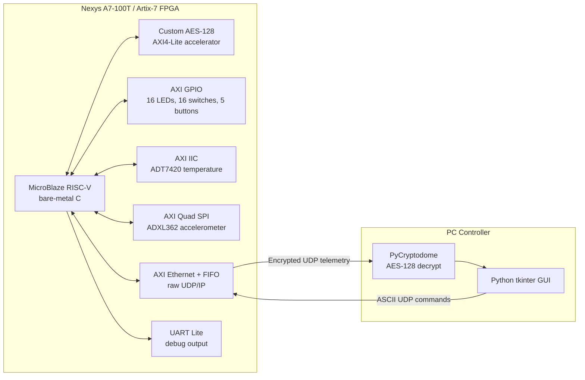
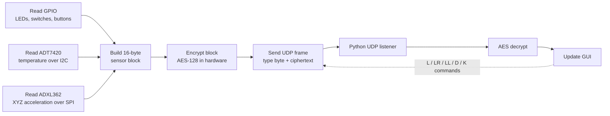

# FPGA-Based IoT Gateway with AES-128 Hardware Encryption


This project is an end-to-end IoT gateway built on a Digilent Nexys A7-100T FPGA board. It reads board I/O and sensor data, encrypts each telemetry frame with a custom AES-128 hardware accelerator, broadcasts the encrypted data over UDP/Ethernet, and displays the decrypted stream in a Python desktop controller.

The work spans the full path: VHDL crypto logic, AXI4-Lite integration, a bare-metal MicroBlaze RISC-V application, raw Ethernet/UDP packet handling, I2C/SPI sensor drivers, and a PC controller that can both monitor and command the board.

## What It Does

- Samples the Nexys A7 LEDs, switches, push buttons, ADT7420 temperature sensor, and ADXL362 3-axis accelerometer.
- Packs the state into a 16-byte telemetry block.
- Encrypts that block with a custom AES-128 core implemented in VHDL.
- Sends the encrypted payload over UDP broadcast.
- Receives and decrypts packets in a Python/tkinter GUI.
- Sends control commands back to the board to toggle LEDs, rotate LEDs, change the transmit interval, and update the AES key.
- Verifies the AES implementation with GHDL testbenches and NIST/FIPS-197 test vectors.

## Hardware Target

| Item | Details |
| --- | --- |
| FPGA board | Digilent Nexys A7-100T |
| FPGA part | `xc7a100tcsg324-1` |
| FPGA family | Xilinx Artix-7 |
| CPU | MicroBlaze RISC-V soft processor |
| Clock | 100 MHz system clock |
| FPGA tooling | Vivado 2025.1 project |
| Host controller | Python 3 desktop app |

## System Architecture



## Data Flow



## Main Components

### Custom AES-128 Core

The AES core lives in [`CoreAes128/`](CoreAes128/). It is a from-scratch VHDL implementation of AES-128 encryption for one 128-bit block at a time, based on the FIPS-197 specification.

Implemented blocks:

- `sub_bytes`
- `shift_rows`
- `mix_columns`
- `add_round_key`
- `key_expansion`
- `aes_round`
- `aes_core`

The core has a simple `start` / `busy` / `done` interface. The Vivado project wraps it as an AXI4-Lite IP so the firmware can write a key and plaintext block, start encryption, poll for completion, and read back the ciphertext. Encryption completes in roughly 12 clock cycles, which is fast enough that polling is simpler than adding an interrupt path.

### FPGA Gateway Application

The gateway firmware lives in [`SimplifiedIotGateway/IoTGatewayApp/src/`](SimplifiedIotGateway/IoTGatewayApp/src/). It runs bare-metal on the MicroBlaze RISC-V soft processor and ties the board together:

- Initializes AXI Ethernet, FIFO, GPIO, I2C, SPI, and the AES accelerator.
- Reads the ADT7420 temperature sensor over I2C.
- Reads the ADXL362 accelerometer over SPI.
- Reads 16 switches, 16 LEDs, and 5 push buttons through AXI GPIO.
- Builds the telemetry block in a fixed big-endian wire format.
- Calls the AES accelerator through memory-mapped registers.
- Builds raw Ethernet, IPv4, and UDP headers in C.
- Broadcasts encrypted telemetry frames.
- Parses simple ASCII UDP commands from the PC controller.

The Vivado project and custom IP live in [`SimplifiedIotGateway/`](SimplifiedIotGateway/). The AES accelerator package is under [`SimplifiedIotGateway/CustomIps/axi_custom_aes_128_accel_1_0/`](SimplifiedIotGateway/CustomIps/axi_custom_aes_128_accel_1_0/).

### Python Controller

The PC-side controller lives in [`IotGatewayController/`](IotGatewayController/). It receives encrypted packets, decrypts them with PyCryptodome, parses the sensor payload, and updates a tkinter GUI.

The GUI displays:

- LED state, with clickable LED indicators that send toggle commands.
- Switch state.
- Push-button state.
- Temperature in degrees C.
- Accelerometer X/Y/Z readings in mg.
- Packet count, sequence number, and last update time.

It can also send commands to change the board transmit delay, update the AES key, and rotate the LED pattern. There is a small accelerometer-driven window movement mode as a visual demo of live sensor feedback.

## Packet Format

Each telemetry packet is 17 bytes on the wire:

- Byte 0 is a plaintext packet type.
- Bytes 1 to 16 are one AES-128 encrypted block.

The plaintext type byte lets the receiver identify the packet before decrypting it. The current implementation uses `0x01` for sensor data and leaves the field open for future packet types.

| Wire bytes | Field | Size | Notes |
| --- | --- | ---: | --- |
| `0` | Type | 1 byte | Plaintext, `0x01` for sensor packet |
| `1..16` | Ciphertext | 16 bytes | AES-128 encrypted sensor block |

The decrypted 16-byte sensor block is:

| Block bytes | Field | Type | Notes |
| --- | --- | --- | --- |
| `0` | Sequence | `u8` | Incremented by the FPGA |
| `1..2` | LED state | `u16` | Big-endian |
| `3..4` | Switch state | `u16` | Big-endian |
| `5` | Button state | `u8` | Lower 5 bits used |
| `6..7` | Temperature | `u16` | ADT7420 raw register value |
| `8..9` | Accel X | `s16` | ADXL362 reading |
| `10..11` | Accel Y | `s16` | ADXL362 reading |
| `12..13` | Accel Z | `s16` | ADXL362 reading |
| `14..15` | Reserved | 2 bytes | Zero-filled |

## Command Protocol

Commands are ASCII UDP payloads sent from the controller to the FPGA.

| Command | Example | Action |
| --- | --- | --- |
| `L<n>` | `L5` | Toggle LED `n`, where `n` is 0 to 15 |
| `LR` | `LR` | Rotate LEDs right |
| `LL` | `LL` | Rotate LEDs left |
| `D<ms>` | `D1000` | Set telemetry interval in milliseconds |
| `K<32 hex chars>` | `K2B7E151628AED2A6ABF7158809CF4F3C` | Set the AES-128 key |

## Network Configuration

| Parameter | Value |
| --- | --- |
| FPGA MAC | `00:0A:35:00:01:02` |
| FPGA IP | `192.168.1.10` |
| Telemetry destination IP | `192.168.1.255` broadcast |
| FPGA UDP source port | `5000` |
| PC telemetry listen port | `6000` |
| Controller command destination | `192.168.1.255:5000` |

## AES Accelerator Register Map

| Offset | Name | Access | Description |
| --- | --- | --- | --- |
| `0x00` | `CTRL` | R/W | Bit 0 starts encryption |
| `0x04` | `STATUS` | R | Bit 0 = done, bit 1 = busy |
| `0x08` | `KEY0` | R/W | `key[127:96]` |
| `0x0C` | `KEY1` | R/W | `key[95:64]` |
| `0x10` | `KEY2` | R/W | `key[63:32]` |
| `0x14` | `KEY3` | R/W | `key[31:0]` |
| `0x18` | `PT0` | R/W | `plaintext[127:96]` |
| `0x1C` | `PT1` | R/W | `plaintext[95:64]` |
| `0x20` | `PT2` | R/W | `plaintext[63:32]` |
| `0x24` | `PT3` | R/W | `plaintext[31:0]` |
| `0x28` | `CT0` | R | `ciphertext[127:96]` |
| `0x2C` | `CT1` | R | `ciphertext[95:64]` |
| `0x30` | `CT2` | R | `ciphertext[63:32]` |
| `0x34` | `CT3` | R | `ciphertext[31:0]` |

Software sequence:

1. Deassert `start`.
2. Write the 128-bit AES key.
3. Write the 128-bit plaintext block.
4. Assert `start`.
5. Poll `STATUS.done`.
6. Read the 128-bit ciphertext.
7. Deassert `start`.

## Repository Layout

```text
.
|-- CoreAes128/
|   |-- src/                         # VHDL AES-128 implementation
|   |-- tb/                          # GHDL testbenches
|   `-- Makefile                     # Simulation targets
|-- SimplifiedIotGateway/
|   |-- CustomIps/
|   |   `-- axi_custom_aes_128_accel_1_0/
|   |       |-- hdl/                 # AXI4-Lite wrapper
|   |       `-- src/                 # AES VHDL packaged as Vivado IP
|   |-- IoTGatewayApp/src/           # Bare-metal C firmware
|   |-- platform/                    # Generated Xilinx platform files
|   `-- SimplifiedIotGateway.xpr     # Vivado project
|-- IotGatewayController/
|   |-- gui.py                       # tkinter UI
|   |-- network.py                   # UDP listener/sender
|   |-- protocol.py                  # packet parser and AES key
|   `-- main.py                      # app entry point
|-- IotGatewayPresentation.pdf       # original project presentation
`-- IotGatewayThumbnail.gif          # demo GIF used in this README
```

## Running The AES Simulations

Requirements:

- GHDL
- Surfer or GTKWave for waveform viewing

```bash
cd CoreAes128
make run-all
```

Useful targets:

```bash
make run       # run the selected testbench
make view      # open wave.vcd in the configured viewer
make clean
```

The default full-core testbench checks multiple known AES-128 vectors, including NIST/FIPS-197 examples.

## Running The Controller

`tkinter` needs to be installed through the system package manager. On Ubuntu/Debian:

```bash
sudo apt-get install python3-tk
```

Then create a virtual environment and install the Python dependency:

```bash
cd IotGatewayController
python3 -m venv venv
source venv/bin/activate
pip install -r requirements.txt
python3 main.py
```

The controller listens for telemetry on UDP port `6000` and sends commands to `192.168.1.255:5000`.

## Building The FPGA Project

Open [`SimplifiedIotGateway/SimplifiedIotGateway.xpr`](SimplifiedIotGateway/SimplifiedIotGateway.xpr) in Vivado 2025.1. The project already references the Nexys A7-100T board definition and includes the packaged custom AES accelerator IP.

The firmware source is in [`SimplifiedIotGateway/IoTGatewayApp/src/`](SimplifiedIotGateway/IoTGatewayApp/src/). It is meant to be built against the generated Xilinx platform in [`SimplifiedIotGateway/platform/`](SimplifiedIotGateway/platform/).

## Technologies Used

| Area | Technologies |
| --- | --- |
| FPGA logic | VHDL, AXI4-Lite, Vivado custom IP packaging |
| Processor system | MicroBlaze RISC-V, AXI interconnect, BRAM, UART Lite |
| Board I/O | AXI GPIO, LEDs, switches, push buttons |
| Sensors | ADT7420 over I2C, ADXL362 over SPI |
| Networking | AXI Ethernet, AXI Ethernet FIFO, raw Ethernet/IPv4/UDP |
| Firmware | Bare-metal C, Xilinx standalone BSP |
| Desktop app | Python 3, tkinter, sockets, PyCryptodome |
| Verification | GHDL, VHDL testbenches, NIST/FIPS-197 vectors, VCD waveforms |

## Security Notes

This is a hardware/embedded systems project, not a production security design. The current packet format encrypts one fixed-size block with AES-128 and does not include authentication, an IV/nonce, replay protection, or key exchange. For a real deployment I would add an authenticated mode, explicit message counters, and a proper key provisioning flow.

That limitation is intentional for this project: keeping the payload to one AES block made the hardware/software boundary clear and let the focus stay on implementing and integrating the custom accelerator.
